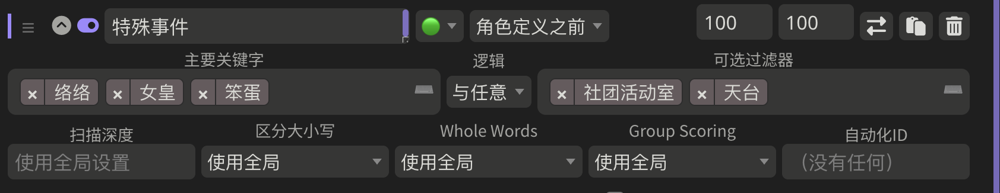
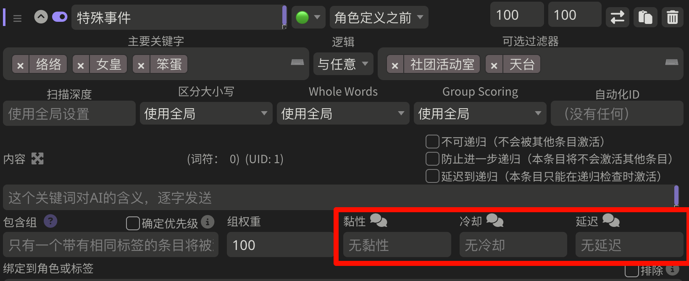
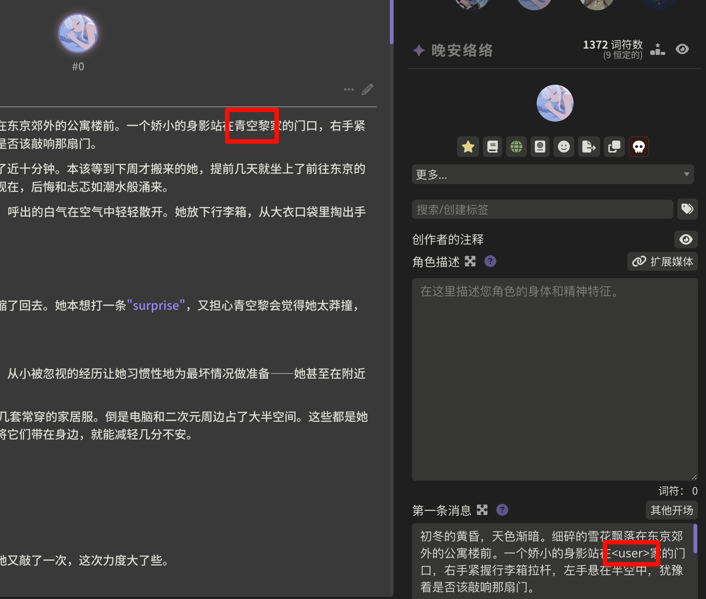
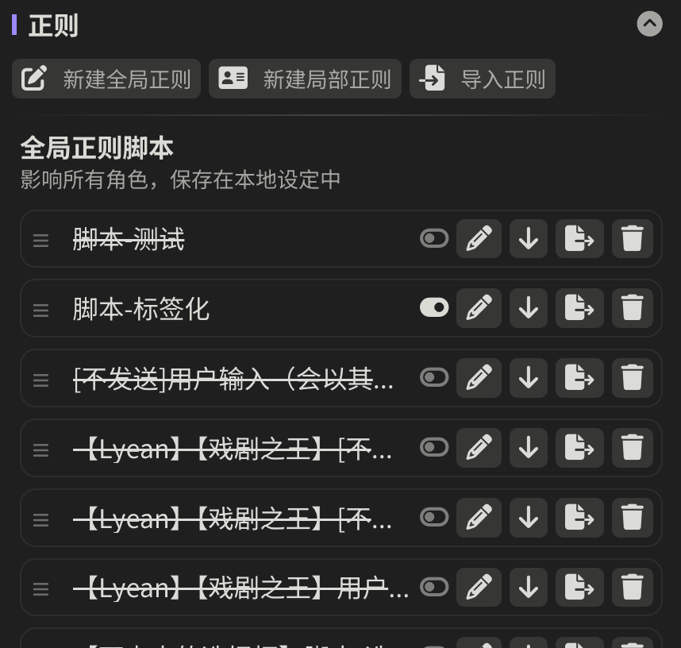
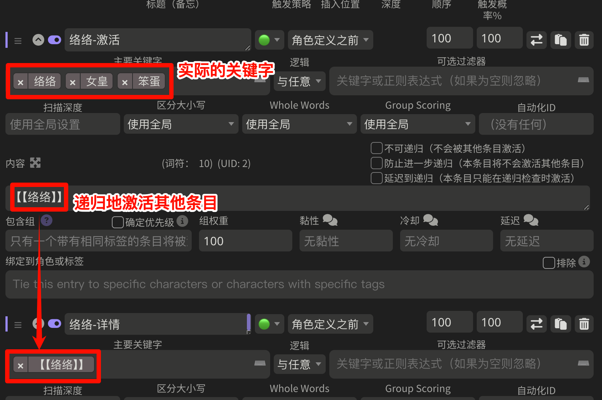

************************************************************************************************************************
世界书条目的激活
************************************************************************************************************************

首先, 强烈建议你将世界书全局设置和预设设置改为下图那样, 这应能带来最好的游戏体验: (尤其是现在大家开始用 :doc:`正则替换setvar </tool_and_experience/variable_in_lorebook_without_qr/index>`、`酒馆助手插件 <https://n0vi028.github.io/JS-Slash-Runner-Doc/>`_ 和 `提示词模板插件 <https://discord.com/channels/1134557553011998840/1336648321963524127>`_)

.. figure:: 世界书推荐全局设置.png

  世界书推荐全局设置

.. figure:: 预设推荐设置.png

  预设推荐设置

之后对条目激活的解释, 我将默认你采用了这样的设置, 因此会忽略上下文百分比等造成的影响.

.. warning::

  此外我还会略过 "绑定到角色或标签"、"包含组" 等功能, 因为我觉得不够好用.

========================================================================================================================
基本术语
========================================================================================================================

世界书条目 (entry)
  .. figure:: 世界书条目.png

提示词 (prompt)
  即世界书的内容部分. 世界书条目如果被使用, 则将会把这部分发给 ai.

  .. figure:: 提示词.png

启用 (enable) [#1]_
  表示我们打开了条目. 在没有其他扩展的情况下, 酒馆只会考虑使用打开了的条目.

  .. [#1] 如果你的世界书界面没有下图那样的 :guilabel:`启用` 开关, 说明酒馆版本太老了; 相比于我同时解释老版本的界面, 你可能更应该更新酒馆.

  .. figure:: 启用.png

激活/触发 (activate)
  表示已经确认某世界书条目应该被使用, 它的提示词将会发给 ai.

  我们从酒馆后台或 ai 消息右上角的 :guilabel:`提示词`, 可以看到某次进行对话时, 提示词的发送情况:

  .. tabs::

    .. tab:: 酒馆后台

      .. figure:: 酒馆后台.png

    .. tab:: ai 消息右上角的 :guilabel:`提示词`

      .. figure:: ai右上角提示词按钮.png

      .. figure:: ai消息原始提示词显示.png

递归 (recursion)
  表示某世界书条目被激活后, 该条目的提示词又激活了其他条目. 具体将会在下文中解释.

========================================================================================================================
单个条目的激活
========================================================================================================================

在不考虑递归和其他条目作用的情况下, 单个条目的激活需要考虑以下要求:

------------------------------------------------------------------------------------------------------------------------
启用
------------------------------------------------------------------------------------------------------------------------

你需要启用条目才能激活它.

------------------------------------------------------------------------------------------------------------------------
激活概率% (触发概率%)
------------------------------------------------------------------------------------------------------------------------

.. figure:: 激活概率.png

条目的激活会进行一次概率判定, 如果概率判定成功且满足其他要求, 则条目将会被激活. 它默认为 100%, 即概率判定必定成功.

------------------------------------------------------------------------------------------------------------------------
激活策略 (触发策略)
------------------------------------------------------------------------------------------------------------------------

.. figure:: 激活策略.png

🔵: 常量 (constant), 俗称蓝灯
  无额外要求. 只需要满足 "启用"、"激活概率%" 等别的要求即可.

🟢: 可选项 (selective), 俗称绿灯
  要求欲扫描文本满足一定条件. (具体什么是欲扫描文本见下文.)

🔗: 向量化 (vectorized)
  这个激活策略涉及向量存储, 我没玩过, 略.

也就是说, 激活策略设置为蓝灯意味着不在此做额外考虑; 而绿灯则意味着对欲扫描文本有一定要求.

^^^^^^^^^^^^^^^^^^^^^^^^^^^^^^^^^^^^^^^^^^^^^^^^^^^^^^^^^^^^^^^^^^^^^^^^^^^^^^^^^^^^^^^^^^^^^^^^^^^^^^^^^^^^^^^^^^^^^^^^
欲扫描文本: 初次解释
^^^^^^^^^^^^^^^^^^^^^^^^^^^^^^^^^^^^^^^^^^^^^^^^^^^^^^^^^^^^^^^^^^^^^^^^^^^^^^^^^^^^^^^^^^^^^^^^^^^^^^^^^^^^^^^^^^^^^^^^

什么是欲扫描文本呢? 你现在可以认为就是你的聊天正文——你和 ai 的消息——经过一些处理后的结果. 这些处理我们在本文最后再说明, 对于你理解世界书条目的激活流程并不造成影响.

^^^^^^^^^^^^^^^^^^^^^^^^^^^^^^^^^^^^^^^^^^^^^^^^^^^^^^^^^^^^^^^^^^^^^^^^^^^^^^^^^^^^^^^^^^^^^^^^^^^^^^^^^^^^^^^^^^^^^^^^
绿灯条件: 欲扫描文本中精确地包含一段文本
^^^^^^^^^^^^^^^^^^^^^^^^^^^^^^^^^^^^^^^^^^^^^^^^^^^^^^^^^^^^^^^^^^^^^^^^^^^^^^^^^^^^^^^^^^^^^^^^^^^^^^^^^^^^^^^^^^^^^^^^

我们前面提到, 将激活策略设置为绿灯就是要求欲扫描文本满足一定的条件. 这能有什么作用呢?

首先要知道的是, ai 的上下文和注意力都是有限的, 因此我们不可能将一整本《神话版三国》 (我写下这段话时, 它已连载了 2179 万字) 全部塞给 ai.

那么, 假设我们有一张人物众多的角色卡, 而其中只有一位名为 ``络络`` 的角色出场, 我们显然希望仅激活 ``络络`` 的详情条目发给 ai, 而绿灯就能做到这一点: 它可以要求欲扫描文本必须精确地包含 ``络络`` 这段文本才激活条目.

这是怎么做到的呢? 我们展开条目, 在 :guilabel:`主要关键字 (primary keyword)` 中填入 ``络络``:

.. figure:: 绿灯条件-单个主要关键字.png

这样一来, 仅当欲扫描文本中存在 ``络络`` 这段文本时, 这个 ``络络-详情`` 条目才会激活.

.. warning::

  绿灯条目必须要有至少一个关键字, 否则将永远不满足激活策略.

^^^^^^^^^^^^^^^^^^^^^^^^^^^^^^^^^^^^^^^^^^^^^^^^^^^^^^^^^^^^^^^^^^^^^^^^^^^^^^^^^^^^^^^^^^^^^^^^^^^^^^^^^^^^^^^^^^^^^^^^
欲扫描文本: 扫描深度
^^^^^^^^^^^^^^^^^^^^^^^^^^^^^^^^^^^^^^^^^^^^^^^^^^^^^^^^^^^^^^^^^^^^^^^^^^^^^^^^^^^^^^^^^^^^^^^^^^^^^^^^^^^^^^^^^^^^^^^^

但消息楼层可能很长, 我自己玩过 2000 楼消息. 显然, 当我们玩第 2000 楼时, 我们不希望仅仅在第 0 楼出现过的 ``青空莉`` 文本依旧激活对应世界书条目. 为此, 酒馆允许你为所有世界书或单个世界书条目设置扫描深度: 如果设置扫描深度为 ``n``, 则激活将仅扫描最后 ``n`` 条消息.

我的世界书推荐全局设置将扫描深度设置为 ``2``, 则游玩时将仅扫描你的最后一条输入和 ai 的最后一条回复.

.. figure:: 扫描深度.png

^^^^^^^^^^^^^^^^^^^^^^^^^^^^^^^^^^^^^^^^^^^^^^^^^^^^^^^^^^^^^^^^^^^^^^^^^^^^^^^^^^^^^^^^^^^^^^^^^^^^^^^^^^^^^^^^^^^^^^^^
绿灯条件: 欲扫描文本中精确地包含文本A或文本B
^^^^^^^^^^^^^^^^^^^^^^^^^^^^^^^^^^^^^^^^^^^^^^^^^^^^^^^^^^^^^^^^^^^^^^^^^^^^^^^^^^^^^^^^^^^^^^^^^^^^^^^^^^^^^^^^^^^^^^^^

可是我们不仅希望正文中提到 ``络络`` 时激活 ``络络-详情条目``, 还希望提到 ``女皇``、``笨蛋`` 时也激活它. 为此, 我们可以用英文输入法下的逗号 ``,`` (半角逗号) 来间隔这些文本, 将它们全都填入 :guilabel:`主要关键字` 中, 即 ``络络,女皇,笨蛋``. 当然你也可以加空格显得好看一些: ``络络, 女皇, 笨蛋``.

.. figure:: 绿灯条件-多个主要关键字.png

这样一来, 只要欲扫描文本中出现这三个关键字中任意一个, 就会激活这个条目.

^^^^^^^^^^^^^^^^^^^^^^^^^^^^^^^^^^^^^^^^^^^^^^^^^^^^^^^^^^^^^^^^^^^^^^^^^^^^^^^^^^^^^^^^^^^^^^^^^^^^^^^^^^^^^^^^^^^^^^^^
绿灯条件: 关键字的显示模式
^^^^^^^^^^^^^^^^^^^^^^^^^^^^^^^^^^^^^^^^^^^^^^^^^^^^^^^^^^^^^^^^^^^^^^^^^^^^^^^^^^^^^^^^^^^^^^^^^^^^^^^^^^^^^^^^^^^^^^^^

如果你害怕自己将逗号错误地输入为中文输入法下的逗号而没能正确分割关键字, 可以切换关键字的显示模式为标签模式:

.. figure:: 切换关键字的显示模式.png

这样一来每个关键字都将被独立显示. 此外, 你将有一个下拉框, 这个下拉框中会列出世界书中包含的所有关键字.

.. figure:: 关键字标签模式.png

^^^^^^^^^^^^^^^^^^^^^^^^^^^^^^^^^^^^^^^^^^^^^^^^^^^^^^^^^^^^^^^^^^^^^^^^^^^^^^^^^^^^^^^^^^^^^^^^^^^^^^^^^^^^^^^^^^^^^^^^
绿灯条件: 欲扫描文本中精确地包含文本A和文本B
^^^^^^^^^^^^^^^^^^^^^^^^^^^^^^^^^^^^^^^^^^^^^^^^^^^^^^^^^^^^^^^^^^^^^^^^^^^^^^^^^^^^^^^^^^^^^^^^^^^^^^^^^^^^^^^^^^^^^^^^

假设 ``络络`` 是一名学生, 我们也许希望她在 ``社团活动室`` 时才触发某个事件. 这意味着我们希望欲扫描文本中同时存在 ``络络`` 和 ``社团活动室`` 时才激活条目.

要做到这一点, 我们需要使用 :guilabel:`逻辑` 和 :guilabel:`可选过滤器`. 将 :guilabel:`逻辑` 设置为 ``与任意``, 在 :guilabel:`可选过滤器` 中填入 ``社团活动室``:

.. figure:: 绿灯条件-单对单与任意.png

这样一来, 只有欲扫描文本中同时出现了 ``络络`` 和 ``社团活动室``, 这个条目才会被激活.

你当然可以填写更多, 例如你也许希望只要络络处于 ``社团活动室`` 或 ``天台`` 时才激活该条目, 而络络本身可以由 ``络络``、``女皇`` 或 ``笨蛋`` 激活:

也就是说, 当右边的 :guilabel:`可选过滤器` 填写有关键字时, 绿灯除了在左边的 :guilabel:`主要关键字` 中任意匹配到一个关键字, 还需要按照规定的 :guilabel:`逻辑` 满足右边的 :guilabel:`可选过滤器`. 具体地:

- :guilabel:`与任意 (and any)`: 要求右边任意一个关键字能在欲扫描文本中匹配到
- :guilabel:`与所有 (and all)`: 要求右边所有关键字都能在欲扫描文本中匹配到
- :guilabel:`非所有 (not all)`: 要求右边至少有一个关键字在欲扫描文本中没能匹配到
- :guilabel:`非任何 (not any)`: 要求右边所有关键字都没在欲扫描文本中匹配到

.. hint::

  在本文最后的 :ref:`世界书条目_一些进阶技巧` 中将会有一些简化这些关键字的技巧.

^^^^^^^^^^^^^^^^^^^^^^^^^^^^^^^^^^^^^^^^^^^^^^^^^^^^^^^^^^^^^^^^^^^^^^^^^^^^^^^^^^^^^^^^^^^^^^^^^^^^^^^^^^^^^^^^^^^^^^^^
绿灯条件: 欲扫描文本能被某个正则表达式匹配
^^^^^^^^^^^^^^^^^^^^^^^^^^^^^^^^^^^^^^^^^^^^^^^^^^^^^^^^^^^^^^^^^^^^^^^^^^^^^^^^^^^^^^^^^^^^^^^^^^^^^^^^^^^^^^^^^^^^^^^^

绿灯的关键字除了用 ``络络`` 这样的精确文本之外, 还可以是正则表达式——满足一定格式的一串文本.

想象一下, 如果我们要用精确文本来匹配 000 到 100 的数字, 需要怎么做? ``000, 001, 002, 003, 别列了人麻了😨, 100``. 而如果使用正则表达式, 你只需要在绿灯关键字中填写 ``/正则表达式/设置``, 此处即是 ``/\d{1,3}/``

.. figure:: 绿灯条件-正则表达式.png

这是一个容易入门但难以精通的计算机工具. 我在此不会展开解释. 我个人推荐使用《正则表达式必知必会》来学习它, 用 `regex101 <https://regex101.com/>`_ 来测试匹配情况, 而非完全依赖 ai 编写.

通过用正则表达式作为关键字, 你可以做到 :ref:`分阶段激活不同条目等效果 (不过我会更推荐你使用第三方插件来做) <世界书条目_一些进阶技巧>`.

.. _世界书条目_时效功能:

------------------------------------------------------------------------------------------------------------------------
时效功能: 黏性、冷却、延迟
------------------------------------------------------------------------------------------------------------------------

时效功能允许我们用上一次世界书的激活情况影响下一次世界书的激活: 上一次激活了所以这次继续激活, 上一次激活了所以这次不准激活.

酒馆提供了如图所示的三种时效功能:

黏性 (sticky)
  条目激活后, 在之后 ``n`` 条消息内始终激活, 无视激活策略、激活概率%.

  .. code-block:: text

    黏性: 5, 激活概率: 50%
    ================================================================================
    [0] ai 消息
    [1] 玩家消息: 开始游戏
    [2] ai 消息: 50% 激活概率判定未通过, 激活失败
    [3] 玩家消息
    [4] ai 消息: 50% 激活概率判定通过, 激活成功, 触发黏性 5
    [5] 玩家消息: 黏性 5
    [6] ai 消息: 因黏性而继续激活, 黏性 4
    [7] 玩家消息: 黏性 3
    [8] ai 消息: 因黏性而继续激活, 黏性 2
    [8] 玩家消息: 黏性 1
    [8] ai 消息: 50% 激活概率判定未通过, 激活失败

冷却 (cooldown)
  条目激活后, 在之后 ``n`` 条消息内不能再激活.

  .. code-block:: text

    冷却: 5
    ================================================================================
    [0] ai 消息
    [1] 玩家消息: 开始游戏
    [2] ai 消息: 激活, 触发冷却 5
    [3] 玩家消息: 冷却 5
    [4] ai 消息: 因冷却而不能激活, 冷却 4
    [5] 玩家消息: 冷却 3
    [6] ai 消息: 因冷却而不能激活, 冷却 2
    [7] 玩家消息: 冷却 1
    [8] ai 消息: 激活

  它可以和黏性一起使用, 则激活的条目在一定消息数内先保持激活, 再进入冷却

  .. code-block:: text

    黏性: 3, 冷却: 3
    ================================================================================
    [0] ai 消息
    [1] 玩家消息: 开始游戏
    [2] ai 消息: 激活, 触发黏性 3
    [3] 玩家消息: 黏性 3
    [4] ai 消息: 因黏性而继续激活, 黏性 2
    [5] 玩家消息: 黏性 1
    [6] ai 消息: 因冷却而不能激活, 冷却 3
    [7] 玩家消息: 冷却 2
    [8] ai 消息: 因冷却而不能激活, 冷却 1
    [8] 玩家消息
    [8] ai 消息: 激活

延迟 (delay)
  聊天中至少有 ``n`` 楼消息时, 才能激活条目.

  .. code-block:: text

    延迟: 5
    ================================================================================
    [0] ai 消息
    [1] 玩家消息: 开始游戏
    [2] ai 消息: 因延迟而不能激活
    [3] 玩家消息
    [4] ai 消息: 激活

它们的效果仅作用于当前聊天, 并有以下特点:

- 如果消息发生重 roll 或删除, 所有目前已被触发的时效功能全部失效: 例如, ``络络-详情`` 条目的黏性时效功能已经触发, 因而下几条消息中该条目将会被始终激活; 重 roll 或删除消息之后, 这个效果将不再存在.
- 如果条目被修改, 它已经被触发的时效功能失效.

========================================================================================================================
正文? 递归? 一次完整的世界书扫描
========================================================================================================================

有了对单个条目如何激活的认识, 我们接下来开始了解我所推荐的世界书全局设置中启用的一个重要功能: 递归扫描. 简单来说, 它允许你用一个已激活条目的内容来激活另一个条目:

.. figure:: 绿灯被始终激活.png

这是怎么做到的呢?

------------------------------------------------------------------------------------------------------------------------
欲扫描文本: 在递归中变化
------------------------------------------------------------------------------------------------------------------------

我们前面提到, 欲扫描文本是 *规定扫描深度* 下的正文经过一些处理后的结果——这其实只构成了世界书扫描的第一轮激活.

当第一轮激活结束后, 所有被激活条目的提示词将会加入到欲扫描文本中 (同样经过一些处理), 进行第二轮激活尝试.

然后, 新激活条目的提示词也会加入到欲扫描文本中, 继续尝试新的激活……这样的激活尝试会 **直到有一轮不再有条目被激活** 时才结束. 这就是整个递归扫描.

需要注意的是, 如果条目设置了激活概率%, 只要在其他条件满足的情况下概率判定失败过一次, 酒馆在本次世界书扫描中就不会再考虑激活这个条目.

------------------------------------------------------------------------------------------------------------------------
条目递归相关设置
------------------------------------------------------------------------------------------------------------------------

.. figure:: 条目递归相关设置.png

不可递归 (exclude recursion)
  该条目不会被其他条目递归激活.

防止进一步递归 (prevent recursion)
  该条目不会递归激活其他条目.

延迟到递归 (delay until recursion)
  该条目只在至少第 ``n`` 次递归及以后才能被激活.

  .. figure:: 递归等级.png

  **这个选项的使用需要特别注意**. 为什么呢? 递归扫描的停止条件是 **直到有一轮不再有条目被激活**, 而并不考虑有条目被延迟到第 n 次递归才激活. 极端地说, 如果我们在此处填写 999, 则条目很可能永远不被激活——世界书扫描很可能在第 2 次递归时就不再激活任何条目而停止了!

------------------------------------------------------------------------------------------------------------------------
绿灯 :guilabel:`逻辑`: :guilabel:`非所有` 和 :guilabel:`非任何` 的局限性
------------------------------------------------------------------------------------------------------------------------

以 :guilabel:`非所有` 为例, 作为实际例子, 让我们取 ``络络`` :guilabel:`非所有` ``学校``, 则它是欲扫描文本匹配到了 ``络络`` 且没有匹配到 ``学校`` 时才激活条目.

如果我们只对正文进行世界书扫描, 这不会有任何问题; 但引入递归后就不再是这样. `酒馆只会激活条目, 不会取消已激活条目的激活 <https://github.com/SillyTavern/SillyTavern/issues/2213>`_: 假设对正文的扫描确实匹配到了 ``络络`` 且没有匹配到 ``学校``, 显然条目应该被激活; 之后即便递归扫描时欲扫描文本中有了 ``学校`` 这个文本, 这个条目仍然会保持激活状态!

因此, 我的建议是:

- 只针对正文部分使用 :guilabel:`非所有` 和 :guilabel:`非任何`.
- 如果非要针对递归情况使用它们, 务必保证左边的匹配和右边的不匹配都在同一轮递归扫描中发生.

========================================================================================================================
欲扫描文本会经历的处理
========================================================================================================================

我们最开始说欲扫描文本就是你的聊天正文, 之后又提到了扫描深度 ``n`` 和递归. 你也许认为, 至少最初的欲扫描文本会是最后 ``n`` 条聊天正文, 而递归时将加入那些激活了且没有勾选 :guilabel:`防止进一步递归` 的条目……不, 这还不太对.

------------------------------------------------------------------------------------------------------------------------
宏替换
------------------------------------------------------------------------------------------------------------------------

我们在第一条消息中, 很可能见到过 ``{{user}}``、``<user>`` 这样的文本, 它将会被替换为你所写的用户名. 其实除了 ``{{user}}`` 以外, 酒馆还有如 ``{{char}}``、``{{getvar::变量}}`` 等需要替换的文本, 它们被称为宏 (macro). 而在提示词作为欲扫描文本之前, 酒馆会对这些宏一一进行替换.

  第一条消息中的宏

------------------------------------------------------------------------------------------------------------------------
仅格式提示词正则
------------------------------------------------------------------------------------------------------------------------

此外, 我们还需要考虑酒馆正则对欲扫描文本的影响.

回想一下你目前所使用的预设, 其中是否有思维链 (``<thinking>``)、摘要/总结等功能?

为了实现这些功能, 作者通常需要提供配套的酒馆正则让你导入. 这些正则可能实现以下效果:

影响界面显示
  比如让你在聊天界面中 *看不到* 思维链. 这由正则设置中的 :guilabel:`仅格式显示` 控制.

影响发送给AI的内容
  比如实现 "不发送6楼以上除摘要外的文本" 的效果. 这由正则设置中的 :guilabel:`仅格式提示词` 控制.

.. figure:: 正则格式选项.png

:guilabel:`仅格式提示词` 既然是要影响 ai 会接收到什么内容, 自然也会影响我们用来判断是否激活世界书条目的欲扫描文本.

------------------------------------------------------------------------------------------------------------------------
总结
------------------------------------------------------------------------------------------------------------------------

也就是说, 最初的欲扫描文本是我们的聊天正文经过宏替换和仅格式提示词正则处理后的结果; 而在递归过程中, 新激活的条目也会经过宏替换和仅格式提示词正则处理, 然后加入到欲扫描文本中.

这也许带来思维上的繁琐, 但我得提醒你它们的好处:

宏替换允许我们动态化提示词
  这意味着我们可以 :ref:`让世界书条目内容动态变化 <世界书条目_一些进阶技巧>`.

  此外, 这里所说的提示词不仅限于世界书, 还包括其他所有会发给 ai 的部分. `Lyean 预设 <https://discord.com/channels/1134557553011998840/1274681338556846101>`_ 就是这样允许你自行设置的!

  .. figure:: Lyean预设提示词设置.png

仅格式提示词正则允许我们用正则表达式调整欲扫描文本和最终发送给 ai 的内容
  略.

.. _世界书条目_一些进阶技巧:

========================================================================================================================
一些进阶世界书条目技巧
========================================================================================================================

------------------------------------------------------------------------------------------------------------------------
一次性条目
------------------------------------------------------------------------------------------------------------------------

我们将冷却值设置为 ``9999``, 则条目激活后, 在之后 ``9999`` 条消息中都不能再激活该条目.

.. hint::

  为了延长这个条目的效果而不是只在一次回复里生效, 你可以设置一个适度的黏性值.

------------------------------------------------------------------------------------------------------------------------
绝对激活的绿灯
------------------------------------------------------------------------------------------------------------------------

正则表达式 ``/./s`` 能够匹配任意字符, 因此使用它作为绿灯的关键字将让绿灯始终激活.

------------------------------------------------------------------------------------------------------------------------
仅当正文里不包含某些文本才激活的绿灯
------------------------------------------------------------------------------------------------------------------------

左边设置为 ``/./s``, 逻辑选择 :guilabel:`非所有` 或 :guilabel:`非任意`, 右边填写正文中不应包含的关键字.

------------------------------------------------------------------------------------------------------------------------
专门用于激活其他条目的条目
------------------------------------------------------------------------------------------------------------------------

很多时候, 我们的多个条目会共用同一组关键字. 一个经典的例子是角色分为 "详情"、"关键信息"、"阶段1"、"阶段2"、"阶段3" 等. 但这样一来每次需要更改关键字时都需要手动复制粘贴它们, 还需要人工检查是否都改对了.

我对此的简单解决办法是, 新建一个 ``络络-激活`` 条目, 而用这个条目的内容递归地去激活其他 ``络络`` 条目:

这样一来, 我只需要调整 ``络络-激活`` 条目, 就能做到蓝灯、排除递归等激活调整.

------------------------------------------------------------------------------------------------------------------------
分阶段条目? 动态世界书?
------------------------------------------------------------------------------------------------------------------------

绿灯的关键字可以是正则表达式, 由此衍生出了分段好感度等写法: 一个条目的关键字匹配好感度 0~19, 另一个条目的关键字匹配好感度 20~39……

此外, 我们提及了欲扫描文本是宏替换和仅格式提示词正则作用后的结果, 在这两个环节我们也能做很多有意思的事情.

**但我已经不推荐你自己闭门造车**, 现在最简单的动态世界书教程是:

络络的更宝宝级教程
  - `discord <https://discord.com/channels/1134557553011998840/1356503085475958834>`_
  - `智识库网页 <https://wiki.类脑.org/智识库/类脑教程/酒馆使用/超简单版本：基于提示词模板的分阶段好感度人设>`_
  - `示例角色卡 <https://files.catbox.moe/w2r2g6.png>`_

此外, 我的角色世界书条目写法见于: :doc:`本文开头部分 </tool_and_experience/variable_in_lorebook_without_qr/complex/index>`.

========================================================================================================================
自行编写代码控制条目的激活
========================================================================================================================

你可以使用以下方式, 自行编写代码来激活条目:

- `官方 STScript <https://rentry.org/sillytavern-script-book>`_ 所提供的 ``/inject position=none scan=true id=填写一个唯一名称 "关键字"`` 相当于在正文中加入一串欲扫描文本, 可用于激活绿灯条目. 除非用命令移除, 这个扫描文本将会永久存在; 如果需要仅在下一次扫描中激活条目, 可以加上 ``ephemeral=true``.
- `提示词模板 <https://discord.com/channels/1134557553011998840/1336648321963524127>`_

  - 提供的 ``<%= await getWorldInfo("世界书名称", "条目名称") _>`` 将会被替换为对应的条目文本. 这实际不涉及条目本身的激活, 因此无所谓条目是否被启用.
  - 提供的 ``<%_ await activateWorldInfo("世界书名称", "条目名称") _%>`` 将会激活对应的条目. 用它激活的条目仍会受除激活条目以外.

- `酒馆助手 <https://discord.com/channels/1134557553011998840/1296494001406345318>`_ 所提供的……怎么还没做! 没事, 它可以调用上面的方法😋
