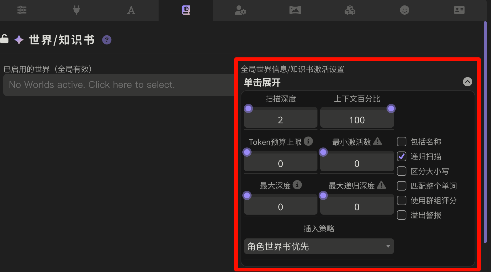

########################################################################################################################
角色阶段: 精确记录最新数值、为不同角色绑定不同变量、为每个阶段显示特殊名称
########################################################################################################################

.. error::

  除世界书条目写法以外的内容已弃用, 请使用 `MVU 变量框架 <https://discord.com/channels/1134557553011998840/1367871200235229234>`_

`原帖 <https://discord.com/channels/1134557553011998840/1308984948794982421>`_

络络的更宝宝级教程
  - `discord <https://discord.com/channels/1134557553011998840/1356503085475958834>`_
  - `智识库网页 <https://wiki.类脑.org/智识库/类脑教程/酒馆使用/超简单版本：基于提示词模板的分阶段好感度人设>`_
  - `示例角色卡 <https://files.catbox.moe/w2r2g6.png>`_

精确记录最新数值
  采用聊天变量记录数值, 并相比于 QuickReply 容易出错, 这种方式能够保证删除楼层或重 roll 后变量依旧正确.

为不同角色绑定不同变量 (仅复杂版实现)
  某个角色应该用好感度, 另一个角色却要用堕落度? 某个角色的数值跨度是每增加 10 点更新一个阶段, 另一个却是每减少 1 点更新一个阶段? 没问题.

为每个阶段显示特殊名称 (仅复杂版实现)
  总是在状态栏显示数值太无聊了? 让 ai 自觉地更新角色阶段名称吧: 羞涩抗拒(0~24)-欲拒还迎(25~49)-共犯默契(50~74)-沉沦释放(75~99)-灵肉相许(100以上).

.. note::

  以下内容默认依赖于递归扫描 (一个条目被发送的文本激活后, 条目中的文本会激活更多条目), 因此我有一个 "角色-激活" 列表; 不担心递归导致 token 爆炸则不需要这样考虑.

========================================================================================================================
原理
========================================================================================================================

通过发送 ``{{setvar::心爱好感度::0}}``, 我们可以在当前聊天中设置一个变量 ``心爱好感度``, 之后发送 ``{{getvar::心爱好感度}}`` 即能得到对应的值. 这样的变量是在当前聊天中有效的, 被记录在聊天文件的开头.

.. figure:: 聊天文件开头.png

因此, 我们只需要让 ai 能够更新这个变量, 并用这个变量进行正则匹配, 即可得到精确的结果.

但我们很难直接要求 ai 回复 ``{{setvar::变量名::更新的值}}``, 因为我们无论通过输入还是世界书, 向 ai 发送这个要求时, 这部分都会被替代为一次变量设置.

.. figure:: 不能直接要求.png

  发送给 ai ``你必须在回应中给出 {{setvar::心爱好感度::新的值}}`` 时实际发送的内容

所以我们需要要求 ai 回应一种特定格式来表示变量更新, 并通过正则匹配, 将它输出的特定格式替换为 ``{{setvar::变量名::更新的值}}``. 我采用的格式如下:

.. code-block:: text

  @${变量名$}=${旧值$}→${新值$}@

========================================================================================================================
实现
========================================================================================================================

文本中所有的 ``# 注释`` 都是本教程的注释, 并不是条目实际内容.

我写角色卡是在 VSCode 中编写条目, 再使用 :doc:`脚本 </工具经验/世界书同步脚本/index>` 将它同步到酒馆中. 在这个过程中脚本会对内容进行压缩, 因而酒馆里的世界书比较难读. 因此, **看示例角色卡时别忘了下载它的世界书源文件**.

.. toctree::
  :maxdepth: 1

  复杂版/index

========================================================================================================================
显示变量给玩家看
========================================================================================================================

如果你想将某个变量显示给玩家看, 你应该使用正则: 勾选 "仅格式显示", 在 :guilabel:`替换为` 中填入要显示的变量为 ``{{getvar::变量}}``. 具体可以导入 :download:`示例角色卡-显示变量.png` 参考其内正则.

这种方法相比于传统的状态栏方法, 甚至不需要额外消耗 token.

========================================================================================================================
调试方法
========================================================================================================================

------------------------------------------------------------------------------------------------------------------------
安装 SillyTavern Variable Viewer 插件
------------------------------------------------------------------------------------------------------------------------

安装 ``https://github.com/LenAnderson/SillyTavern-Variable-Viewer/`` 插件, 方法见图:

.. figure:: 打开安装插件界面.png

.. figure:: 进行安装.png

然后, 你可以在聊天框输入 ``/variableviewer`` 来开关变量查看器.

------------------------------------------------------------------------------------------------------------------------
查看变量变化情况
------------------------------------------------------------------------------------------------------------------------

如果要在每次 ai 输出时能直接查看变量的更新情况, 可以用示例角色卡中的 "调试: 设置变量"、"调试: 隐藏变量更新分析" 和 "调试: 隐藏变量更新" 正则.

------------------------------------------------------------------------------------------------------------------------
确认变量是否更新
------------------------------------------------------------------------------------------------------------------------

.. warning::

  这样的查看方式存在延迟, "设置变量" 正则同时启用了 "仅格式显示" 和 "仅格式提示词", 变量除了因为 "仅格式显示" 在刷新网页、加载聊天等更新外, 还会在发送消息时更新.

^^^^^^^^^^^^^^^^^^^^^^^^^^^^^^^^^^^^^^^^^^^^^^^^^^^^^^^^^^^^^^^^^^^^^^^^^^^^^^^^^^^^^^^^^^^^^^^^^^^^^^^^^^^^^^^^^^^^^^^^
通过酒馆
^^^^^^^^^^^^^^^^^^^^^^^^^^^^^^^^^^^^^^^^^^^^^^^^^^^^^^^^^^^^^^^^^^^^^^^^^^^^^^^^^^^^^^^^^^^^^^^^^^^^^^^^^^^^^^^^^^^^^^^^

你可以在聊天区任意位置或者发送 ``{{getvar::变量::值}}`` 来获取最新的变量值, 也可以发送 ``/echo {{getvar::变量::值}}`` 等来得知.

^^^^^^^^^^^^^^^^^^^^^^^^^^^^^^^^^^^^^^^^^^^^^^^^^^^^^^^^^^^^^^^^^^^^^^^^^^^^^^^^^^^^^^^^^^^^^^^^^^^^^^^^^^^^^^^^^^^^^^^^
通过聊天文件
^^^^^^^^^^^^^^^^^^^^^^^^^^^^^^^^^^^^^^^^^^^^^^^^^^^^^^^^^^^^^^^^^^^^^^^^^^^^^^^^^^^^^^^^^^^^^^^^^^^^^^^^^^^^^^^^^^^^^^^^

变量被记录在聊天文件开头, 你可以导出聊天文件或去存档 (一般在 ``SillyTavern/default-user/chats/角色卡名称/聊天文件``, 更推荐这种, 用 VSCode 打开能看见变量实时更新) 来获取聊天文件, 然后用记事本、VSCode 等查看聊天文件开头

.. figure:: 聊天文件开头.png

.. _正则替换变量法辅助:

========================================================================================================================
解决与摘要/总结的冲突问题
========================================================================================================================

为了省 token 和避免重复, 本方法只需要在最新楼层给出变量更新, 而不需要列出所有变量. 例如:

.. code-block:: text

  === 0 楼 ===
  更新前的变量: (无)
  本楼更新情况: @心爱受孕=否@ @心爱好感度=0@
  更新后的变量: @心爱受孕=否@ @心爱好感度=0@

  === 1 楼 ===
  更新前的变量: @心爱受孕=否@ @心爱好感度=0@
  本楼更新情况: @心爱好感度=10@
  更新后的变量: @心爱受孕=否@ @心爱好感度=10@

  === 2 楼 ===
  更新前的变量: @心爱受孕=否@ @心爱好感度=10@
  本楼更新情况: @心爱露出道具=跳蛋@
  更新后的变量: @心爱受孕=否@ @心爱好感度=10@ @心爱露出道具=跳蛋@

可有的玩家喜欢设置摘要 (有的地方叫做总结) 并使用仅保留摘要正则. 这样一来, 以前楼层将只保留摘要而不再有其他文本, 因而我们实际丢失了以前楼层对变量更新情况的文本记录.

**如果你只在 ai 消息中按教程的方法让 ai 更新变量, 那么这不会有什么问题.**

但如果你想在与玩家互动时更新变量, 想在玩家输入中更新变量, 想用代码控制变量更新……那么你应该安装 `酒馆助手 <https://n0vi028.github.io/JS-Slash-Runner-Doc/>`_, 在酒馆助手局部脚本中新建一个脚本, 内容填写为

.. code-block:: typescript

  import 'https://fastly.jsdelivr.net/gh/StageDog/tavern_resource/dist/酒馆助手/正则替换变量法辅助/index.js'

.. hint::

  考虑到性能问题, 如果使用了这个局部正则, 你可以将 "设置变量" 正则和显示变量的正则 (替换为部分有 ``{{getvar::变量}}``) 最大深度设为 2.

------------------------------------------------------------------------------------------------------------------------
脚本作用: 兼容摘要/总结
------------------------------------------------------------------------------------------------------------------------

我们之所以会与摘要/总结发生冲突, 是因为我们每楼仅记录了更新情况, 而非在该楼层时所有变量的情况.

本脚本做了这样一个处理: 在发送新的用户输入或 ai 传回新的回复时, 将所有变量的情况尾附在楼层末尾:

.. code-block:: text
  :emphasize-lines: 4, 10, 16

  === 0 楼 ===
  更新前的变量: (无)
  本楼更新情况: @心爱受孕=否@ @心爱好感度=0@
  本楼变量情况: @心爱受孕=否@ @心爱好感度=0@
  更新后的变量: @心爱受孕=否@ @心爱好感度=0@

  === 1 楼 ===
  更新前的变量: @心爱受孕=否@ @心爱好感度=0@
  本楼更新情况: @心爱好感度=10@
  本楼变量情况: @心爱受孕=否@ @心爱好感度=10@
  更新后的变量: @心爱受孕=否@ @心爱好感度=10@

  === 2 楼 ===
  更新前的变量: @心爱受孕=否@ @心爱好感度=10@
  本楼更新情况: @心爱露出道具=跳蛋@
  本楼变量情况: @心爱受孕=否@ @心爱好感度=10@ @心爱露出道具=跳蛋@
  更新后的变量: @心爱受孕=否@ @心爱好感度=10@ @心爱露出道具=跳蛋@

这样一来, 每楼的变量情况都是完整的, 自然不需要考虑摘要/总结带来的影响. 而这个处理不会增加任何 token.

------------------------------------------------------------------------------------------------------------------------
脚本作用: 允许用户输入更新变量
------------------------------------------------------------------------------------------------------------------------

由于上面的处理, 我们也兼容了用户输入时的一些问题. 现在玩家可以用 ``@变量=值@`` 在输入时更改变量, 你也可以用快速回复 ``/send @变量=值@其他输入内容`` 来发送新的输入.

------------------------------------------------------------------------------------------------------------------------
脚本作用: 自动调整预设上下文长度和世界书全局设置
------------------------------------------------------------------------------------------------------------------------

由于宏等的存在, 酒馆对 token 的计算会虚高, 于是酒馆会在上下文还没有到模型上限时就阻拦提示词发送. 而本脚本会将预设上下文长度锁定在 200 万 token, 并将世界书全局设置改为下图那样:

从而避免了 token 问题, 同时简化了玩家配置.

------------------------------------------------------------------------------------------------------------------------
脚本作用: 辅助酒馆助手代码更新变量
------------------------------------------------------------------------------------------------------------------------

本方法要求所有变量更新都必须以 ``@变量=值@`` 的形式存在于消息文本中, 因此酒馆助手可以用 ``setChatMessage`` 来修改消息楼层的文本, 将 ``@变量=值@`` 尾附到消息末尾从而更新变量.

而本脚本提供了进行这种更新的辅助功能:

通过事件更新变量
  - 其他地方的代码可使用 ``eventEmit('在最新楼层更新变量', {心爱受孕: 否, 心爱好感度: 10})`` 来更新变量.
  - 快速回复中可使用 ``/event-emit event=在最新楼层更新变量 data={"心爱受孕": "否", "心爱好感度": 10}`` 来更新变量

  这样一来, 哪怕在提示词模板中, 你也可以这样更新变量:

  .. code-block:: javascript
    :linenos:

    <%_
    async function 更新变量(data) {
      await SillyTavern.eventSource.emit('在最新楼层更新变量', data);
      await Promise.all(Object.entries(data).map(([key, value]) => setvar(key, value)));
    }

    if (满足了某个条件) {
      await 更新变量({'心爱好感度': 10});
    }
    _%>

在最后一条消息附加 ``@变量=值@`` 从而更新变量
  ``async function updateLastVariables(data: Record<string, any>)``

  .. code-block:: typescript
    :linenos:

    await updateLastVariables({
      '变量.络络.亲密度': 60,
      '变量.络络.下次响应界面选择判断': 2,
    });

解析文本中的所有 ``@变量=值@`` 和 ``@变量=旧值⇒新值@``, 转换为键值对对象
  ``function parseVariables(text: string): Record<string, any>``

  .. code-block:: typescript
    :linenos:

    const variables = parseVariables("@心爱受孕=否@@心爱好感度=10@");
    console.info(variables.心爱受孕);  // 否
    console.info(variables.心爱好感度);  // 10

将键值对对象转换为 ``@变量=值@`` 字符串
  ``function stringifyVariables(data: Record<string, any>): string``

  .. code-block:: typescript
    :linenos:

    const string = stringifyVariables({心爱受孕: 否, 心爱好感度: 10});
    console.info(string);  // @心爱受孕=否@
                           // @心爱好感度=10@

此外, 酒馆助手还支持监听酒馆事件等, 你完全可以做到更有意思的变量更新, 当然也可以用它做其他功能.

========================================================================================================================
与 ``{{user}}`` 的冲突问题
========================================================================================================================

酒馆不支持嵌套宏, 因此不要用 ``{{user}}`` 作为变量名, 而应该用 ``<user>``.

不支持嵌套宏体现在哪呢? ``{{setvar::变量::值}}`` 和 ``{{user}}`` 都是宏, 但 ``{{setvar::被{{user}}接受感情::否}}`` 会被视为 ``{{setvar::被{{user}}`` 和 ``接受感情::否}}``, 而不是先替代内层的 ``{{user}}``, 再替代外层的 ``{{setvar::变量::值}}``.

========================================================================================================================
与酒馆仅加载前 n 条消息的兼容性
========================================================================================================================

如果玩家在酒馆中设置了 "仅加载前 n 条消息", 则他在上滑手动加载以前消息时, 变量将会因旧聊天消息的加载而更新成旧值.

**这一般不会有问题**: "设置变量" 正则同时启用了 "仅格式显示" 和 "仅格式提示词", 变量除了因为 "仅格式显示" 在刷新网页、加载聊天等更新外, 还会在发送消息时更新.

但是, 被 ``/hide`` 隐藏的消息中的变量更新能通过 "仅格式显示" 被正确设置, 而不能通过 "仅格式提示词" 来得到设置. 这就导致了两种特殊情况, 但我认为一般不会有玩家这么处理消息, 哪怕总结姬也很难导致这种特殊情况发生:

.. code-block:: text
  :caption: 旧消息中的变量值被通过正则等间接手段修改, 而消息刚好被隐藏

  0 (hide): @心爱性行为次数=0@ 被改为 @心爱性行为次数=10@
  ...中间心爱性行为次数不变...
  ===以上消息都没被加载, 只会通过 "仅格式提示词" 设置===
  ...中间心爱性行为次数不变...
  400: 发送消息时, 心爱性行为次数会使用原来游玩时设置的 0 而非 10, 因为 "仅格式提示词" 不能处理隐藏消息

.. code-block:: text
  :caption: 中间的消息被隐藏, 因而变量被设置成旧值

  0: @心爱好感度=10@
  1 (hide): @心爱好感度=20@
  2: 发送消息时, 心爱好感度会从 "仅格式显示" 设置的 20 变成 "仅格式提示词" 设置的 10

========================================================================================================================
用变量条件判断
========================================================================================================================

**不要将复杂条件交给小克判断, 小克很容易产生矛盾.** 老老实实配合 QuickReply 或酒馆助手进行.

例如, 设置好感度 (影响人物态度) 和认识度 (当前的描述限制):

- 好感度需要认识度达到一定阶段才能到下一阶段
- 认识度需要好感度达到一定值从而触发事件才到下一阶段

**如果只判断其中一个, 小克做得很好.** 但这种左脚踩右脚的结果是死活触发不出来，试了几天变得不幸了. 这种复杂的该用酒馆助手人为条件判断并启用相应条目了……
