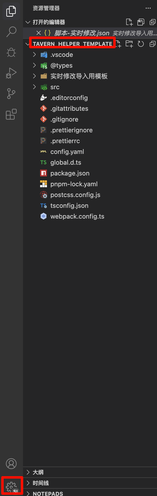
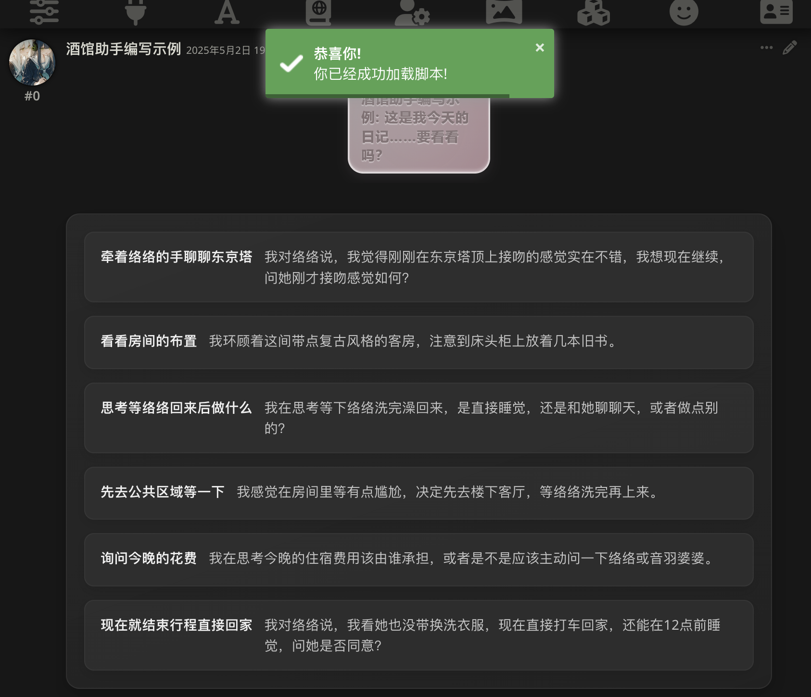
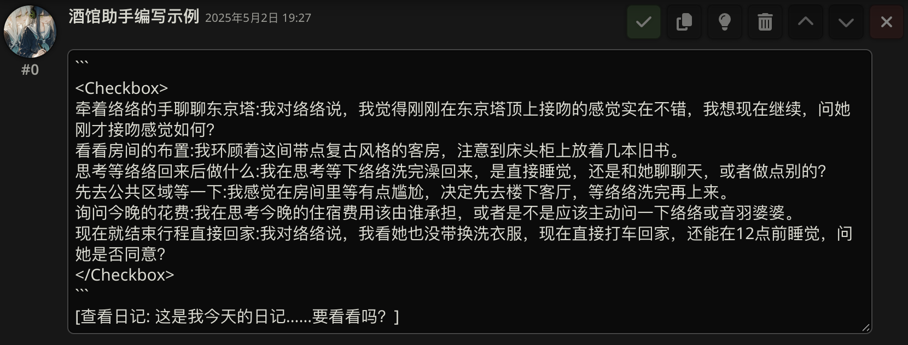
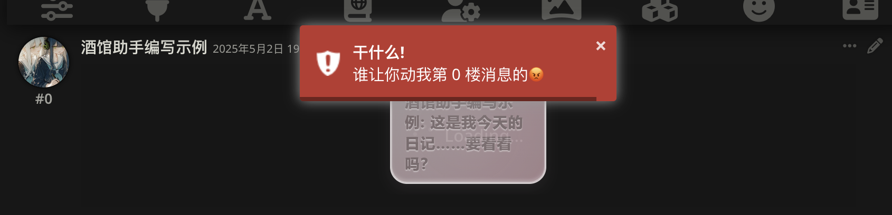
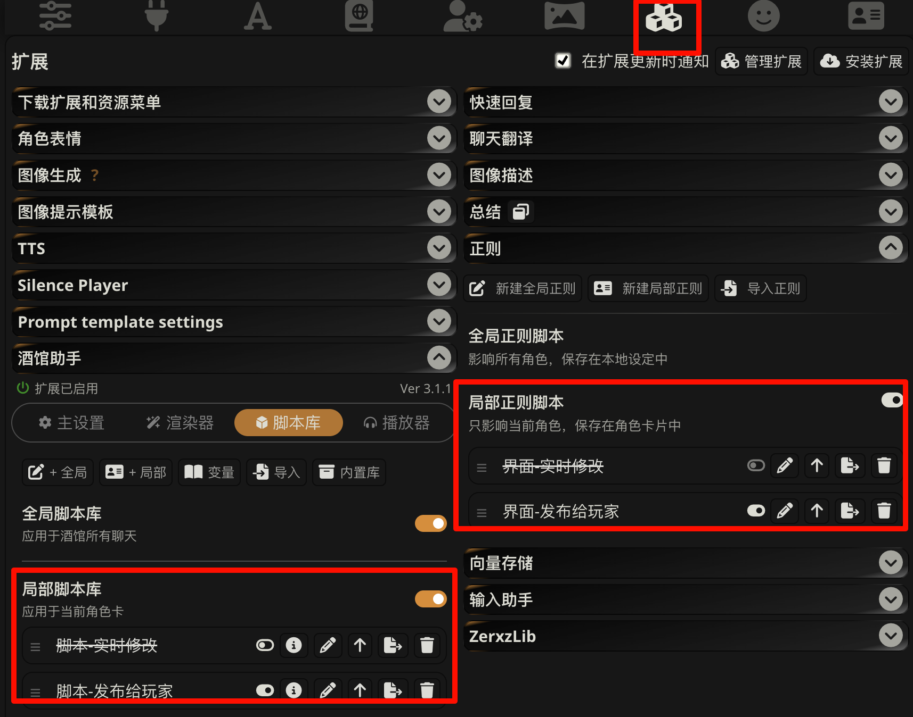
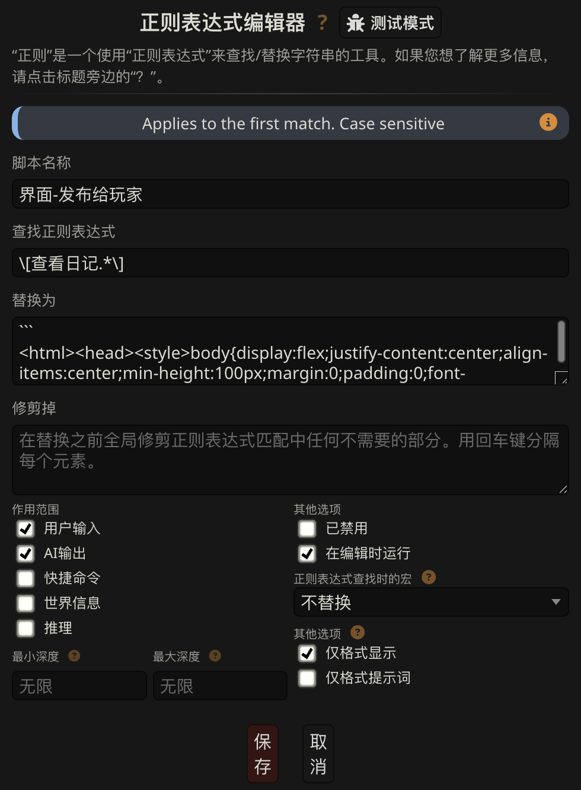
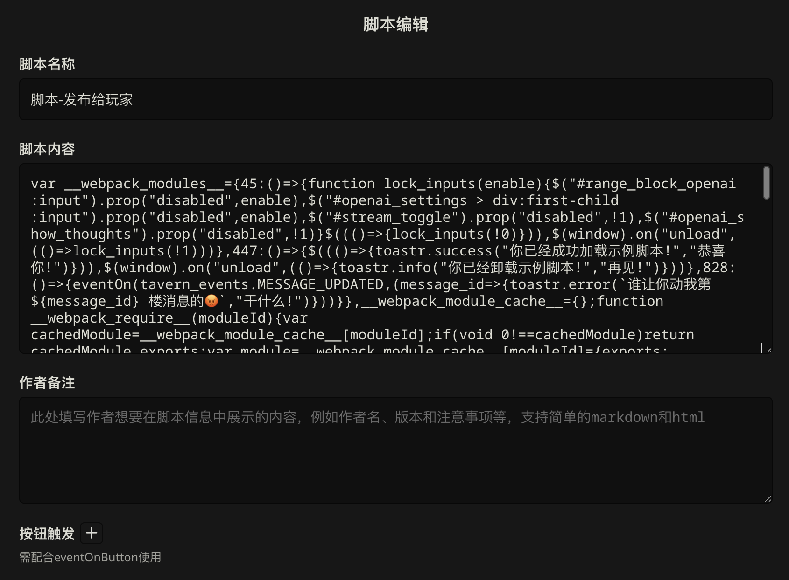

************************************************************************************************************************
准备教学环境
************************************************************************************************************************

========================================================================================================================
用 Cursor 打开文件夹
========================================================================================================================

.. error::

  如果你没有遵循我在上一步提供的环境配置教程, 请至少确认安装了对应的软件. 尤其是, 你的 node 版本必须大于 22, 否则将无法正常运行本项目.

请从 VSCode 或 Cursor 左上角打开 tavern_helper_template 文件夹, 注意如果 tavern_helper_template 里嵌套了一个 tavern_helper_template 文件夹, 则应该开内层那个.

然后, 按之前说过的方式切换 VSCode 或 Cursor 配置文件为 sillytavern.

========================================================================================================================
导入示例角色卡
========================================================================================================================

让我们导入 :resource:`本部分配套的角色卡 <src/工具经验/酒馆助手编写环境配置/示例.png>`.

我们切换到这张角色卡, 会看到一个 "加载成功" 提示, 并在角色卡开局中找到可以点击的粉色日记按钮和深色选择框:

点击按钮或选择框后, 我们会发现发送了一段新的文字; 而在角色卡的世界书里开关条目后, 我们会发现选择框的样式和行为都发生了如条目所描述的变化:

.. raw:: html

  <figure class="align-default">
    <video src="https://gitgud.io/StageDog/tavern_resource/-/raw/main/src/工具经验/酒馆助手编写环境配置/开关世界书.mp4" controls />
  </figure>

怎么会这样? 让我们点击消息楼层右上角的 :guilabel:`铅笔` 看看该楼层实际的文本……等等, 这段文本根本没有什么特殊的地方?!

我们退出编辑, 可恶的青空莉竟然早有预料, 给你发送了一条警告提示:

这一段操作中, 我通过酒馆助手:

- 监听 "消息楼层被修改" 事件, 并对你发出警告.
- 将 ``[查看日记: 这是我今天的日记……要看看吗？]`` 替换为一段界面文本, 而酒馆助手会将这一段文本渲染成实际的日记按钮界面, 并允许你点击它.
- 将原本的代码块 (:code:`\`\`\`` 包裹起来的部分, 原本将会被酒馆渲染成代码块) 替换成选择框界面, 并根据世界书条目开关情况改变这个选择框的行为.

酒馆助手主要在 :guilabel:`酒馆正则` 界面的局部正则和在 :guilabel:`酒馆助手脚本库` 界面的局部脚本中允许你做这些事情, 因此让我们来看看这张角色卡的脚本和界面:

- 界面-实时修改
- (启用) 界面-发布给玩家
- 脚本-实时修改
- (启用) 脚本-发布给玩家

------------------------------------------------------------------------------------------------------------------------
正则中的界面
------------------------------------------------------------------------------------------------------------------------

我们点击 :guilabel:`铅笔` 来编辑 "界面-发布给玩家" 正则, 可以看到其中的 :guilabel:`查找正则表达式` 部分有一段开局原文中出现过的 ``查看日记``.

而根据 :guilabel:`替换为` 部分的描述, 我们不难推测, 这个正则的作用就是匹配一段 ``啥啥啥查看日记啥啥啥`` 的文本, 将它替换为了下面那一段奇形怪状的代码, 而酒馆助手将会据此渲染出一个界面.

因此, 一旦 ai 输出了 ``啥啥啥查看日记啥啥啥`` 的文本, 这段文本就会被正则替换为那段奇形怪状的代码, 而酒馆助手将会据此渲染出粉色日记按钮.

------------------------------------------------------------------------------------------------------------------------
脚本库中的脚本
------------------------------------------------------------------------------------------------------------------------

我们点击 :guilabel:`铅笔` 来编辑 "脚本-发布给玩家" 脚本, 可以看到编辑界面更加简单——只有 :guilabel:`脚本内容` 被填充了一段奇形怪状的代码. 因此酒馆助手对脚本所做的处理也很简单: 它将这段代码加载到网页后台并运行.

因此, 如果我们在这段代码里说 "嘿, 酒馆! 如果玩家编辑了消息, 你就警告他一下!":

.. code-block:: typescript
  :caption: 你没必要看懂的代码

  eventOn(tavern_events.MESSAGE_UPDATED, (message_id: number) => {
    toastr.error(`谁让你动我第 ${message_id} 楼消息的😡`, `干什么!`);
  });

那么在酒馆助手加载这段代码后, 如果玩家编辑了消息, 酒馆就会弹出警告提示.

有了这样基础的理解, 我想你可能已经有了什么特殊的设计: 是让角色能检测到你去玩了别的角色卡而吃醋? 让角色根据现实时间向你问好? 实现预设防误触、世界书成组管理来优化酒馆体验?

……可是如何让 ai 帮我写出脚本和界面呢? 我们接下来学习一下如何成为一个只需动嘴的甲方.
