************************************************************************************************************************
实际使用
************************************************************************************************************************

回顾最开始的视频, 我们只需要在 Cursor 中向 ai 描述想要什么, ai 就会自己修改代码, 而酒馆上将会立即使用修改后的结果:

.. raw:: html

  <figure class="align-default">
    <video src="https://gitgud.io/StageDog/tavern_resource/-/raw/main/src/工具经验/酒馆助手编写环境配置/实时修改.mp4" controls />
  </figure>

本部分就是介绍如何成为这样只动嘴的甲方.

========================================================================================================================
配置项目
========================================================================================================================

------------------------------------------------------------------------------------------------------------------------
安装项目所依赖的第三方库
------------------------------------------------------------------------------------------------------------------------

在 VSCode 中按 :KBD:`Ctrl-Shift-P` 打开命令菜单, 输入 ``toggle terminal`` 以找到 :menuselection:`查看: 切换 终端`, :KBD:`回车` 从而打开 :menuselection:`终端`, 然后在显示的终端中输入 ``pnpm install`` 并回车从而安装本项目模板所需要的第三方库.

在安装完成后, 你将会在项目根目录看到名为 ``node_modules`` 的文件夹, 这个文件夹中就是我们刚刚通过 ``pnpm install`` 安装的第三方库.

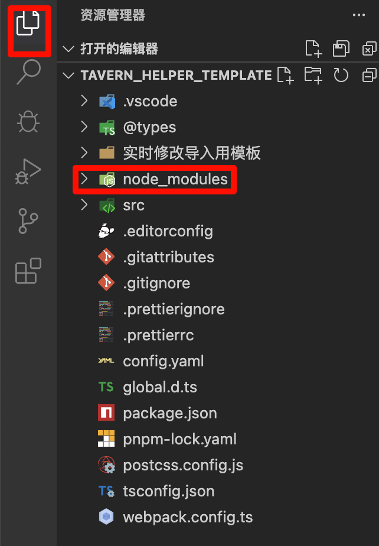

``pnpm install`` 是如何知道需要安装哪些第三方库的呢? 这其实是由 ``package.json`` 文件给出的. 因此, 你在向别人分享代码时完全可以删掉这个占了几百 mb 的文件夹再发送, 让别人自己执行 ``pnpm install`` 安装第三方库.

.. hint::

  你可以通过 ``pnpm add xxx`` 的方式安装更多你需要的第三方库. 当然, 你可能不知道需要什么……别忘了 ai! 你可以在之后编写过程中告诉 ai 让它如果有需要自行安装.

------------------------------------------------------------------------------------------------------------------------
下载参考文件
------------------------------------------------------------------------------------------------------------------------

我们在酒馆助手界面的 :guilabel:`编写参考` 部分, 可以下载两个参考文件:

.. figure:: 下载参考文件.png

助手函数参考
  酒馆助手不仅仅允许你用界面、脚本执行代码, 还提供了各种函数允许你对酒馆进行各种操作, 如修改世界书、修改聊天消息等. 点击 :guilabel:`下载助手函数参考` 后你就能得到保存了这些函数信息的压缩包.

  将它解压并移动到 tavern_helper_template 文件夹内后, Cursor 将能用它进行代码解析.

  .. figure:: 助手函数参考.png

酒馆命令参考
  酒馆本身也提供了一些命令, 如 ``/hide 0-10`` 等. 酒馆助手允许你以 ``triggerSlash(`/hide 0-10`)`` 的形式运行这些命令, 因此让 ai 能了解它们也很有好处. 点击 :guilabel:`下载酒馆命令参考` 后你就能得到保存了这些命令信息的文件 slash_commands.txt.

.. hint::

  助手函数参考会随着酒馆助手的更新而更新, 酒馆命令参考则会随着你酒馆的更新而更新. 因此在酒馆助手、酒馆更新后, 你都应该重新下载这两个参考文件.

------------------------------------------------------------------------------------------------------------------------
确定要编写什么
------------------------------------------------------------------------------------------------------------------------

我们从 Cursor 侧边栏打开 config.yaml 文件, 可以看到其中已经填写有内容, 其中 "示例" 就是我在示例角色卡中所使用的脚本和界面, 而 "模板" 则是便于你快速创建新脚本和界面的模板.

.. code-block:: yaml

  port: 6621
  entries:
    - script: src/脚本示例/index.ts

    - script: src/界面示例/index.ts
      html: src/界面示例/index.html

    - script: src/脚本模板/index.ts

    - script: src/界面模板/index.ts
      html: src/界面模板/index.html

此处我们关注 ``entries`` 字段, 它指定了我们这个项目将会产生的脚本或界面: 每一个 ``-`` 代表一个脚本或界面, 如果只有 ``script`` 没有 ``html`` 则代表这是一个脚本; 如果同时有 ``html`` 和 ``script`` 则代表这是一个界面.

以脚本模板为例. 针对它, 我们填写了 ``script: src/脚本模板/index.ts``, 这表示这个脚本的代码将会以 ``src/脚本模板/index.ts`` 为入口, 从它开始进行执行. 针对 ``src/脚本模板/index.ts``, 我们以 ``/`` 进行分割, 将会注意到 ``src/脚本模板/index.ts`` 被分割成了三部分: ``src``, ``脚本模板`` 和 ``index.ts``. 这与侧边栏所显示的文件结构是一致的:

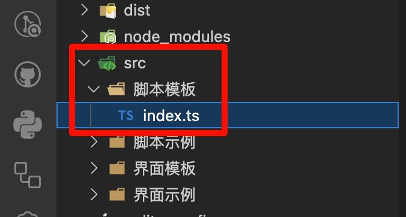

也就是说, ``script: src/脚本模板/index.ts`` 表示这个脚本以 src 文件夹下的 脚本示例 文件夹下的 index.ts 文件为入口, 从它开始进行执行.

出于方便, 你可以通过在侧边栏 :menuselection:`右键文件-复制相对路径` 的方式获取这样的文件路径, 填入 ``script:`` 后.

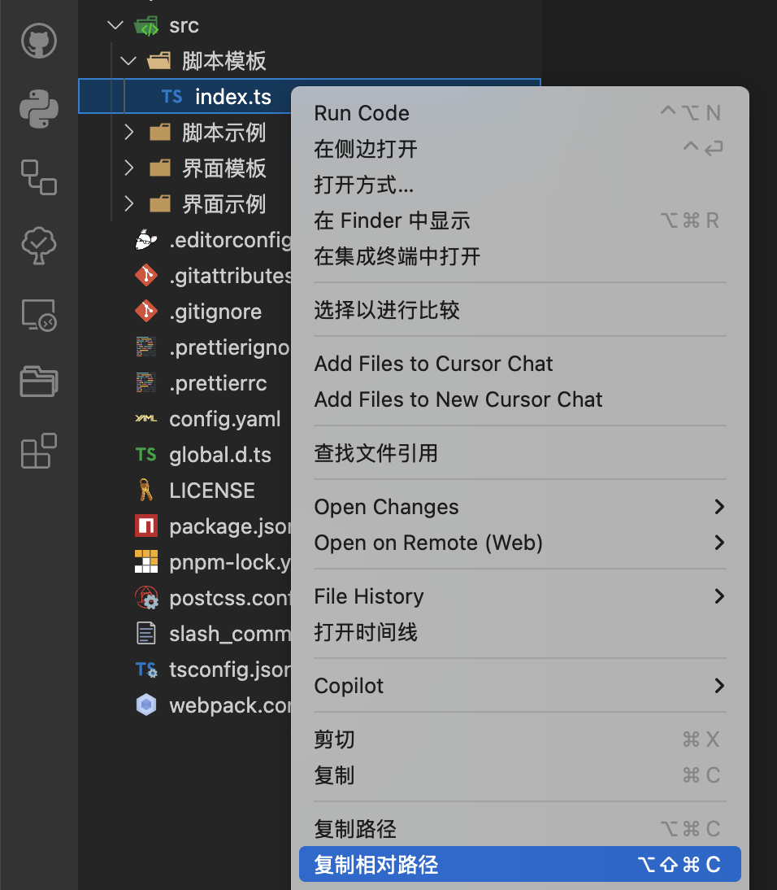

界面的配置填写与脚本类似. 需要注意的是 (听不懂后面一段话没关系, 照着模板做就好了!), 界面的 ``.html`` 文件中必须包含一个 ``<head></head>`` 标签, 而样式文件 ``.css`` 或 ``.scss`` 应该被 ``import`` 进 ``.ts`` 文件中.

========================================================================================================================
实时编写
========================================================================================================================

------------------------------------------------------------------------------------------------------------------------
运行调试和打包任务
------------------------------------------------------------------------------------------------------------------------

我们打开 .vscode 文件夹下的 launch.json 文件, 将其中的 ``url`` 字段修改为你的酒馆地址, 例如 ``http://localhost:6622``.

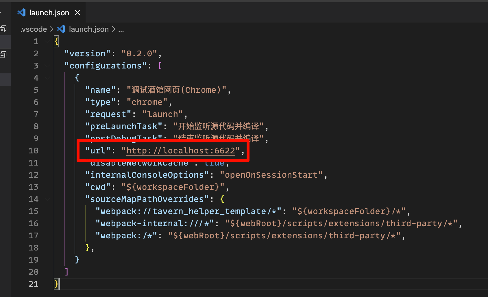

然后, 我们通过 :KBD:`F5` 或侧边栏即可运行调试任务.

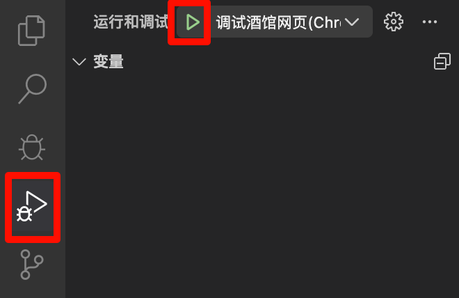

这将为我们打开酒馆页面, 并在终端 (:KBD:`Ctrl+`` 可以打开) 运行打包代码为 dist 文件夹下单文件的任务, 如下图所示, ``src/脚本示例/index.ts`` 及其代码中所引用的其他所有文件都被打包进了 ``dist/src/脚本示例/index.js`` 文件中.

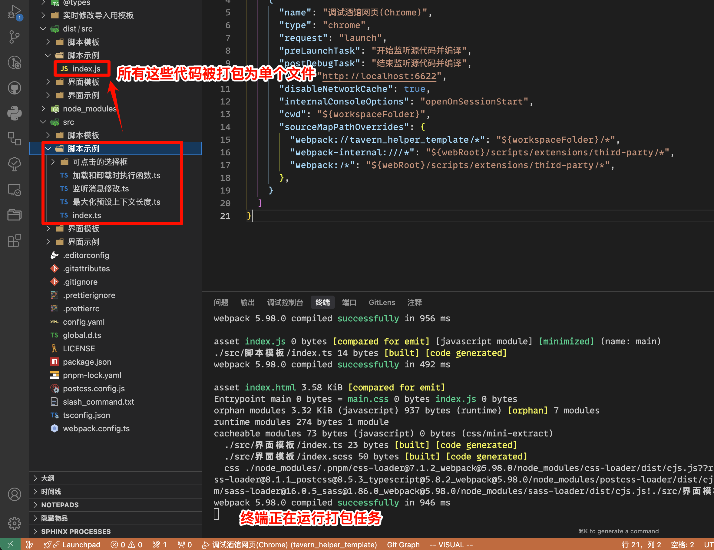

这个打包任务在每次代码发生变更时都会重新打包, 因此 ``dist/src/脚本示例/index.js`` 将永远是最新 "脚本示例" 脚本的打包结果. ``dist/src/界面示例/index.html`` 同理.

------------------------------------------------------------------------------------------------------------------------
启用 Live Server 让文件能被酒馆以链接加载
------------------------------------------------------------------------------------------------------------------------

现在有了始终会是最新代码的单文件打包结果, 我们还需要酒馆页面能加载上它. 为此, 我们使用 Live Server 插件.

我们在 Cursor 右下角点击 :menuselection:`Go Live` 来启用 Live Server. 在启用后, 该图标将会改为显示 :menuselection:`Port: xxxx`. 请记住这里的数字.

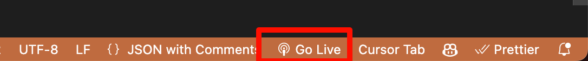

以 5500 为例, 这意味着你将能在 ``http://localhost:5500`` 访问 tavern_helper_template 文件夹下的文件. 例如, ``dist/src/脚本示例/index.js`` 文件将能通过 ``http://localhost:5500/dist/src/脚本示例/index.js`` 访问.

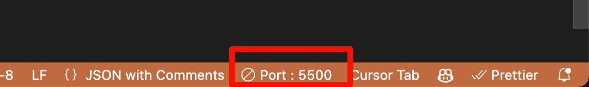

等等……也就是说这个链接将永远是最新的打包结果, 我们只要让酒馆从这个链接加载脚本和界面, 就能让酒馆加载上最新的代码!

这正是示例角色卡中 "脚本-实时修改" 脚本和 "界面-实时修改" 正则所做的事情, 你也可以通过 实时修改导入用模板 文件夹下的脚本和正则文件导入它们:

.. tabs::

  .. tab:: 脚本-实时修改

    .. code-block:: typescript

      import 'http://localhost:5500/dist/src/脚本示例/index.js'

  .. tab:: 界面-实时修改

    .. code-block:: typescript

      ```
      <body>
      <script>
      $('body').load('http://localhost:5500/dist/src/界面示例/index.html')
      </script>
      </body>
      ```

------------------------------------------------------------------------------------------------------------------------
连接酒馆助手实时修改监听器
------------------------------------------------------------------------------------------------------------------------

但这还不够, 虽然 ``http://localhost:5500/dist/src/脚本示例/index.js`` 永远是最新的打包结果, 但酒馆页面并不会实时地加载上它. 这就好比你在 discord 上换了头像, 却发现之前发的消息还是旧头像, 而只有手动刷新了网页才加载上新的头像.

为了让酒馆页面能实时加载它, 酒馆助手特地内置了实时修改监听器配合本教程的项目模板.

我们从酒馆助手主设置中找到 :guilabel:`实时监听` 并展开, 在其中勾选 :guilabel:`允许监听`, 将 :guilabel:`监听地址` 填写为 ``http://localhost:在config.yaml中的port字段值`` 如 ``http://localhost:6621``.

如果连接无误, 则右边的 wifi 图标会变为绿色:

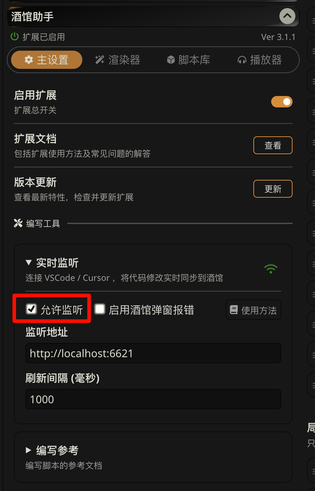

这样一来, 打包器在每次打包时都会提醒酒馆重新加载脚本和界面.

------------------------------------------------------------------------------------------------------------------------
开始提要求
------------------------------------------------------------------------------------------------------------------------

接下来, 你就可以要求 ai 帮你编写脚本或界面了. 为了让 ai 理解酒馆助手, 在要求 ai 写代码时, 请务必向 ai 发送以下文件:

- package.json 文件和 tsconfig.json 文件, 尤其强调可以使用 jquery、jquery-ui、lodash、toastr、yaml 库
- 之前下载解压的助手函数参考文件夹
- 之前下载的酒馆命令文件

具体提示词可以参考 `络络基于本教程进化出来的宝宝教程 <https://discord.com/channels/1134557553011998840/1372487825471176805>`_ 中对应部分.

------------------------------------------------------------------------------------------------------------------------
别看: 为什么叫调试任务?
------------------------------------------------------------------------------------------------------------------------

可能太专业因而不详细解释: 这个项目模板也天然支持断点调试.

========================================================================================================================
让 ai 能看到酒馆页面
========================================================================================================================

无论你是使用 VSCode 还是 Cursor, 都可以使用 `browser-tools-mcp <https://github.com/AgentDeskAI/browser-tools-mcp>`_ 来让 ai 能看到酒馆网页.

------------------------------------------------------------------------------------------------------------------------
安装服务器端
------------------------------------------------------------------------------------------------------------------------

我们需要在对应位置填写以下内容, 具体见图:

.. admonition:: 要填写的内容
  :class: dropdown

  .. code-block:: json

    {
      "mcpServers": {
        "github.com/AgentDeskAI/browser-tools-mcp": {
          "disabled": false,
          "timeout": 60,
          "command": "pnpm",
          "args": [
            "dlx",
            "@agentdeskai/browser-tools-mcp@latest"
          ],
          "transportType": "stdio",
          "autoApprove": [
            "getConsoleLogs",
            "getConsoleErrors",
            "getNetworkErrors",
            "getNetworkLogs",
            "takeScreenshot",
            "getSelectedElement",
            "wipeLogs",
            "runAccessibilityAudit",
            "runPerformanceAudit",
            "runSEOAudit",
            "runNextJSAudit",
            "runDebuggerMode",
            "runAuditMode",
            "runBestPracticesAudit"
          ]
        }
      }
    }

.. tabs::

  .. tab:: Cursor

    .. figure:: 为cursor安装服务器端.png

  .. tab:: Cline

    .. figure:: 为cline安装服务器端.png

然后我们重启软件.

------------------------------------------------------------------------------------------------------------------------
为浏览器安装扩展
------------------------------------------------------------------------------------------------------------------------

我们下载 :resource:`browser-tools-mcp 扩展 <src/工具经验/酒馆助手编写环境配置/BrowserTools-extension.zip>` 文件并解压, 按 :KBD:`F5` 打开调试用的谷歌浏览器, 在新的标签页上方输入 ``chrome://extensions/`` 并回车从而打开扩展页面.

在这个页面, 我们启用 :guilabel:`开发者模式` 后, 点击 :guilabel:`加载已解压的扩展程序` 按钮, 然后选择解压后的文件夹:

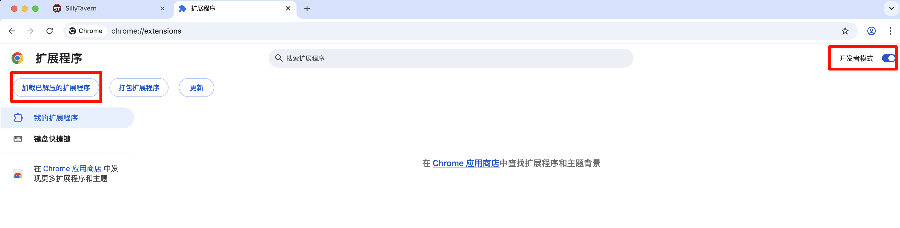

.. error::

  在重开 VSCode 或 Cursor 后, 你可能需要重新为 :KBD:`F5` 所打开的浏览器安装扩展.

------------------------------------------------------------------------------------------------------------------------
实际使用
------------------------------------------------------------------------------------------------------------------------

我们关闭调试而打开的浏览器, 按 :KBD:`F5` 重新打开. 为了让 ai 能看见网页, 我们必须按下 :KBD:`F12` 保证开发者工具是打开状态.

同时, 你可以去 :guilabel:`BrowserToolsMCP` 查看连接情况.

这样一来, 你就可以指示 ai ``你可以自行查看浏览器检查情况`` 了.

========================================================================================================================
用 memory bank 让 ai 更了解项目
========================================================================================================================

直接见于 `络络基于本教程进化出来的宝宝教程 <https://discord.com/channels/1134557553011998840/1372487825471176805>`_ 中对应部分.

========================================================================================================================
发布
========================================================================================================================

在完成脚本或界面的编写后, 你就可以发布它们了.

首先, 让我们停止调试任务:

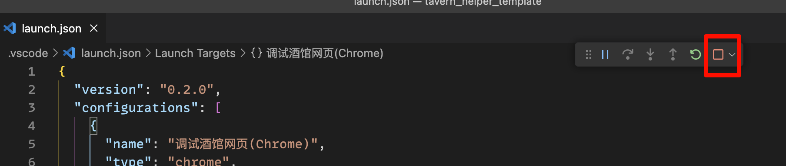

然后, 在终端输入 ``pnpm build`` 并回车, 将代码打包为性能更佳的发行版本.

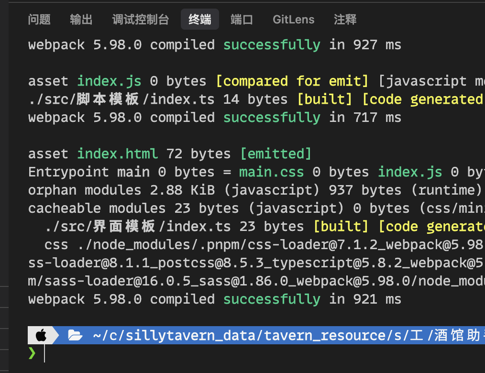

最后, 我们前往 ``dist`` 文件夹复制文件内容, 手动粘贴到脚本或界面文件中. 需要注意的是, 对于界面, 你需要在它上面和下面手动加上 :code:`\`\`\``.

========================================================================================================================
小技巧
========================================================================================================================

既然酒馆助手允许你用代码进行处理, 那么界面正则的正则表达式只需要负责能匹配到文本就好, 至于匹配到的文本则可以完全交由代码处理:

.. tabs::

  .. tab:: 相比于

    .. code-block::
      :caption: 正则表达式

      /<status>衣着[:：](.*?)行为[:：](.*?)<\/status>/s

    .. code-block:: html
      :caption: 替换为

      <html>
      <body>
        <span>$1</span>
        <span>$2</span>
        <script>
          const text = $0;
        </script>
      </body>
      </html>

  .. tab:: 你应该

    .. code-block::
      :caption: 正则表达式

      /<status>.*?<\/status>/s

    .. code-block::
      :caption: 替换为

      <html>
      <body>
        <script>
          const chat_message = getChatMessages(getCurrentMessageId())[0];
          const message = chat_message.message;
          const text = message.match(/<status>(.*?)<\/status>/s)[1];
          // 对文本进行进一步解析……
        </script>
      </body>
      </html>